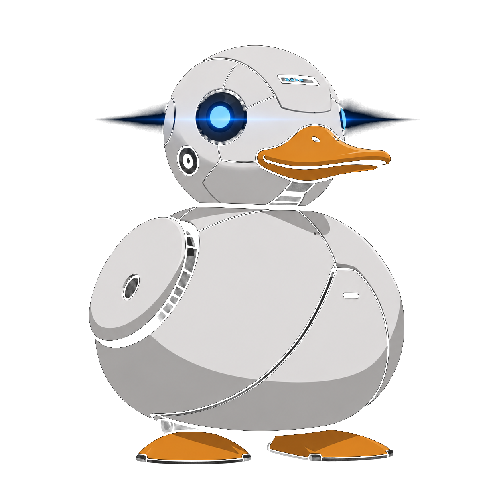
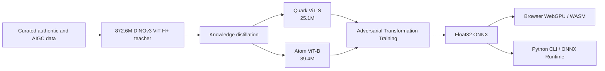

<p align="center">
  
</p>

<h1 align="center">MechaDetect</h1>

<p align="center"><strong>An 872.6M-parameter forensic teacher distilled into 25.1M and 89.4M edge detectors with 0.9931 and 0.9967 mean transformed AUROC.</strong></p>

<p align="center">AIGC detection runs locally through WebGPU or WebAssembly. Images stay in the browser; model weights are downloaded from Hugging Face, and the server performs no AIGC inference.</p>

<p align="center">
  <a href="https://mechadetect-demo-deploy.vercel.app/"></a>
  
  
  
</p>

<p align="center">
  <strong><a href="https://mechadetect-demo-deploy.vercel.app/">Open the live browser demo</a></strong>
  · <a href="#quickstart">Run the CLI</a>
  · Demo video — link pending
</p>

| Model | Parameters | Float32 size | Clean AUROC | Mean transformed AUROC | Primary surface |
|---|---:|---:|---:|---:|---|
| **Quark Super** | 25.1M | 96.1 MB | 0.9947 | 0.9931 | Browser WebGPU/WASM |
| **Atom Super** | 89.4M | 341.3 MB | 0.9980 | 0.9967 | Accuracy-first CLI/desktop |

<p align="center">
  
</p>

<p align="center">
  <a href="#results">Results</a> ·
  <a href="#quickstart">Quickstart</a> ·
  <a href="#how-it-works">How it works</a> ·
  <a href="#data-and-leakage-controls">Data</a> ·
  <a href="#training">Training</a> ·
  <a href="#limitations">Limitations</a>
</p>

---

## Why MechaDetect

Online platforms need AIGC screening capacity to grow with upload and moderation volume. Conventional detectors concentrate that workload in data centres. MechaDetect moves the inference workload to users' devices instead.

The deployed demo downloads a Float32 ONNX model, then processes image tensors inside the browser through WebGPU with WebAssembly fallback. Image bytes are not uploaded for classification. Platforms can add screening without running an inference service for every image.

In this project, **AIGC** includes fully generated images and images whose semantic content was changed by a generative model. Authentic images are negative. JPEG compression, resizing, blur, noise, colour adjustment, and cropping do not change the ground-truth label.

---

## Results

### Held-out organizer benchmark

The headline benchmark contains **13,841 images** excluded from every training pool:

- **4,998 authentic** COCO val2017 images;
- **8,843 AIGC** WildFake DALL·E Advanced images;
- one clean condition and 14 transformed conditions;
- 207,615 evaluations per model across the complete grid.

| Model | Parameters | Size | Clean AUROC | Mean transformed | Worst transformed | AIGC recall | Authentic recall |
|---|---:|---:|---:|---:|---:|---:|---:|
| Quark Normal | 25.1M | 96.1 MB | 0.9921 | 0.9871 | 0.9691 | 97.60% | 92.60% |
| **Quark Super** | **25.1M** | **96.1 MB** | **0.9947** | **0.9931** | **0.9870** | **99.39%** | **83.77%** |
| Atom Normal | 89.4M | 341.3 MB | 0.9973 | 0.9945 | 0.9876 | 98.94% | 94.82% |
| **Atom Super** | **89.4M** | **341.3 MB** | **0.9980** | **0.9967** | **0.9928** | **99.66%** | **93.86%** |

**Normal** variants use the canonical training split. **Super** variants are final-fit models trained across all eligible rows. Quark is the compact browser family; Atom is the higher-accuracy family.

These results place both families in a competitive accuracy range at edge-deployable scales. Atom gives the strongest ranking and authentic recall. Quark cuts the artifact to 96.1 MB and remains above 0.99 mean transformed AUROC.

<details>
<summary><strong>Full 15-condition Float32 AUROC matrix</strong></summary>

| Model | Clean | JPEG 90 | JPEG 70 | JPEG 50 | JPEG 30 | Blur 0.5 | Blur 1.0 | Blur 2.0 | Resize ½ | Resize ¼ | Noise .02 | Noise .05 | Noise .10 | Colour 20% | Crop 80% |
|---|---:|---:|---:|---:|---:|---:|---:|---:|---:|---:|---:|---:|---:|---:|---:|
| Quark Normal | 0.9921 | 0.9939 | 0.9963 | 0.9960 | 0.9950 | 0.9911 | 0.9826 | 0.9763 | 0.9786 | 0.9691 | 0.9912 | 0.9889 | 0.9803 | 0.9919 | 0.9885 |
| Quark Super | 0.9947 | 0.9955 | 0.9968 | 0.9967 | 0.9963 | 0.9947 | 0.9922 | 0.9887 | 0.9907 | 0.9870 | 0.9943 | 0.9928 | 0.9885 | 0.9947 | 0.9942 |
| Atom Normal | 0.9973 | 0.9978 | 0.9992 | 0.9991 | 0.9988 | 0.9977 | 0.9935 | 0.9901 | 0.9876 | 0.9884 | 0.9965 | 0.9938 | 0.9884 | 0.9972 | 0.9954 |
| Atom Super | 0.9980 | 0.9976 | 0.9986 | 0.9989 | 0.9989 | 0.9979 | 0.9965 | 0.9958 | 0.9939 | 0.9928 | 0.9975 | 0.9961 | 0.9940 | 0.9979 | 0.9980 |

</details>

### Error analysis

The operating-threshold trade-off is dominated by false positives on authentic images, not missed AIGC. On clean input, Quark Super produced 811 false positives and 54 false negatives; Atom Super reduced these to 307 and 30. Quarter resizing increased authentic false positives to 1,418 for Quark and 1,197 for Atom while AIGC false negatives remained low at 60 and 15.

Strong downsampling and blur remove camera and texture evidence from authentic images, pushing them toward the AIGC side of the threshold. Conversely, highly realistic synthetic images can preserve camera-like texture and become false negatives. Atom ranks these cases more reliably; Quark makes the browser-size trade-off.

Static INT8 reached 51.1 MB for Quark and 173.3 MB for Atom, but its AUROC degraded materially. Float32 is the supported release format. The graph analysis and PTQ/QAT requirements are in [the INT8 release report](docs/int8_release_evaluation.md).

---

## Quickstart

### Browser demo

Open **[mechadetect-demo-deploy.vercel.app](https://mechadetect-demo-deploy.vercel.app/)**. The demo defaults to Quark Super. Select another model from the catalog, upload or drop an image, and view its AIGC probability. Inference runs in the browser; the server receives no image tensor for classification.

### Environment setup

This repository uses [uv](https://docs.astral.sh/uv/) and the exact dependency versions in `uv.lock`.

<details>
<summary><strong>Windows PowerShell</strong></summary>

```powershell
irm https://astral.sh/uv/install.ps1 | iex
git clone https://github.com/dalzyu/MechaDetect.git
Set-Location MechaDetect
uv sync --locked --dev
Copy-Item .env.example .env
```

</details>

<details>
<summary><strong>Linux / macOS</strong></summary>

```bash
curl -LsSf https://astral.sh/uv/install.sh | sh
git clone https://github.com/dalzyu/MechaDetect.git
cd MechaDetect
uv sync --locked --dev
cp .env.example .env
```

</details>

`uv run` executes inside the project environment without shell activation. The lockfile selects CUDA 13.0 PyTorch wheels for training. Prediction falls back to ONNX Runtime CPU when an accelerated provider is unavailable.

### Predict one image or a directory

```bash
uv run python predict.py \
  --input /path/to/images \
  --output predictions.json
```

Without `--model`, the CLI opens this chooser:

```text
Super models:
  1. Atom Super — 89.4M parameters [default]
  2. Quark Super — 25.1M parameters
  3. More — show Normal variants
```

Choose **More** for Atom Normal and Quark Normal, or bypass the menu:

```bash
uv run python predict.py \
  --input image.jpg \
  --output prediction.json \
  --model quark-super-float32
```

The output contract contains exactly `image_path` and `pred`, where `pred` is $P(\text{AIGC})$:

```json
[
  {
    "image_path": "images/example.jpg",
    "pred": 0.8731
  }
]
```

Supported inputs: JPEG, PNG, WebP, and AVIF. Model files are cached atomically under `.cache/mechadetect/`.

---

## How it works



A controlled backbone tournament selected DINOv3 ViT-H+/16. The PE-Spatial and Gemma comparisons, shortcut probes, confidence intervals, and selection rationale live in the [backbone findings](docs/backbone_bakeoff_findings.md) and [decision record](docs/backbone_bakeoff_decision.md).

<details>
<summary><strong>Full model and training specification</strong></summary>

### Input and target

- RGB input tensor: `Float32[batch, 3, 224, 224]`.
- ImageNet mean and standard-deviation normalization.
- Binary target: authentic = 0; fully generated or generatively edited = 1.
- Output: `[P(authentic), P(AIGC)]`.

### Shared detector architecture

1. DINOv3 ViT backbone with patch size 16.
2. Strip one CLS and four register tokens, retaining 196 patch tokens.
3. `LayerNorm + Linear(encoder_dim → 512)` token adapter.
4. Global evidence head:
   - four learned query vectors;
   - four-head cross-attention;
   - mean and standard-deviation token summaries;
   - 3,072 → 256 GELU/dropout projection.
5. Edit-localization head:
   - token classifier;
   - softmax attention pooling;
   - top-5% patch pooling;
   - learned global query;
   - 1,536 → 256 GELU/dropout projection.
6. Concatenate 256 global and 256 local features.
7. `Linear(512 → 1)` AIGC logit and sigmoid probability.

### Model scales

| Variant | Backbone | Encoder dim | Complete parameters | Data scope |
|---|---|---:|---:|---|
| Normal Teacher | DINOv3 ViT-H+/16 | 1,280 | 872,606,207 | Canonical train |
| Super Teacher | DINOv3 ViT-H+/16 | 1,280 | 872,606,207 | All eligible rows |
| Quark / Quark Super | DINOv3 ViT-S/16 | 384 | 25,089,666 | Canonical / all eligible |
| Atom / Atom Super | DINOv3 ViT-B/16 | 768 | 89,350,914 | Canonical / all eligible |

### Teacher training

- **Stage 1:** frozen ViT-H+ backbone, clean images, train task heads.
- **Stage 2:** unfrozen backbone, paired original/transformed views, BF16, gradient checkpointing, and EMA.
- Optional teacher spectral expert: ConvNeXt-Tiny RGB/residual stream plus fixed high-pass kernels and a 32-bin radial FFT energy projection.

### Distillation

Students learn from hard binary targets, teacher soft predictions, and teacher feature alignment. Quark and Atom train independently and retain the same detector-head contract. The production student exports omit the spectral branch to reduce memory and keep browser execution portable.

### Adversarial Transformation Training

For each row, ATT samples three perturbation candidates from JPEG, blur, resize, noise, colour, and crop families. It scores candidates under `torch.no_grad()`, selects the hardest, and optimizes the clean/hard pair. Membership guards restrict mining and training to the intended training split.

### Losses and promotion

The objective combines original and transformed classification, prediction consistency, feature consistency, teacher soft targets, teacher feature alignment, optional mask focal/dice terms, and EMA consistency. Promotion checks clean ranking, class recall, worst-transformation AUROC, manifest identity, and checkpoint identity.

### Export

Quark and Atom export as Float32 ONNX opset 17 with PyTorch/ONNX parity checks. The browser catalog uses immutable Hugging Face revision URLs and validates artifact SHA-256 and size. Lattice uses opset 18 and four external-data shards because the teacher-scale graph exceeds the inline ONNX size limit.

</details>

---

## Data and leakage controls

Versioned manifests and source audits are published at **[zye2/tj-data](https://huggingface.co/datasets/zye2/tj-data)**. The declared package contains 122,344 records across 29 active cohorts. Preflight quarantined 30,455 unmaterializable or conflicting rows, leaving **87,793 verified eligible records**.

| Manifest | Rows | AIGC / authentic | Purpose |
|---|---:|---:|---|
| `train.parquet` | 51,107 | 28,594 / 22,513 | Canonical Normal-model training |
| `train_super_all.parquet` | 87,793 | 49,120 / 38,673 | Full eligible Super-model final fit |
| `validation.parquet` | 14,617 | 8,187 / 6,430 | Threshold calibration and promotion |
| `test.parquet` | 11,129 | 6,233 / 4,896 | In-distribution evaluation |
| `test_unseen.parquet` | 10,940 | 10,932 / 8 | Unseen-generator stress evaluation |
| `calibration.parquet` | 4,096 | 2,294 / 1,802 | Isolated INT8 calibration only |
| `exclusions.parquet` | 30,455 | — | Missing bytes, mask failures, and conflicts |

### Source and license records

Authentic cohorts include camera photography, portraits, public-domain art, Manga109 illustrations, game captures, and Blender animation. AIGC cohorts include Midjourney, FLUX, GPT Image, Stable Diffusion families, Ideogram, Krea, DALL·E, diffusion baselines, and generative edits.

Each cohort records its origin, source revision, license or governing terms, attribution requirements, and redistribution mode. Users must follow each source's terms rather than assuming one repository-wide dataset license.

### Leakage controls

- SHA-256 identity checks across train, validation, test, and calibration.
- 75,168 SHA-256/perceptual duplicate groups isolated to one split.
- Source-image groups kept together.
- Unseen generator families excluded from canonical training.
- Fail-closed missing-image and mask validation.
- Immutable source revisions and manifest digests.
- Zero organizer-benchmark overlap by file path and SHA-256.
- Explicit rejection of forbidden evaluation cohorts.

### Final-fit protocol

Normal models use `train.parquet`. Super models use `train_super_all.parquet`, which contains all 87,793 eligible rows and therefore includes the canonical validation, test, and calibration subsets. Canonical split metrics are not untouched Super-model holdouts.

The headline results remain valid because every reported metric comes from the separate 13,841-image organizer benchmark, which is excluded from all training pools. The Super numbers are deployment characterization on that disjoint benchmark.

The complete data contract is in [`docs/training_dataset_specification.md`](docs/training_dataset_specification.md).

---

## Training

### Notebook-first workflow

Open the maintained end-to-end workflow from the repository root:

```bash
uv run --with jupyter jupyter lab train.ipynb
```

The notebook executes:

1. locked environment and CUDA verification;
2. immutable manifest download;
3. source-image acquisition and byte verification;
4. leak-free split freezing;
5. teacher Stage 1;
6. teacher Stage 2;
7. teacher evaluation and promotion;
8. sequential Quark and Atom distillation;
9. ATT for both students;
10. clean and transformed evaluation;
11. ATT promotion gates;
12. Float32 ONNX export and parity checks.

`SMOKE_TEST = False` runs the full configured workflow. `SMOKE_TEST = True` limits training stages to two updates for pipeline verification. One CUDA GPU is sufficient; complete teacher training is long.

| Track | Physical batch | Accumulation | Effective batch |
|---|---:|---:|---:|
| Teacher Stage 1 | 6 | 8 | 48 |
| Teacher Stage 2 | 2 | 24 | 48 |
| Quark distillation | 12 | 4 | 48 |
| Atom distillation | 3 | 16 | 48 |
| Quark ATT | 4 | 12 | 48 |
| Atom ATT | 2 | 24 | 48 |

<details>
<summary><strong>Advanced: run individual stages directly</strong></summary>

```bash
# Teacher Stage 1
uv run python -m aigc_detector.train \
  --config configs/teacher_dinov3_stage1_clean_frozen.yaml

# Teacher Stage 2
uv run python -m aigc_detector.train \
  --config configs/teacher_dinov3_stage2_paired_unfrozen.yaml \
  --initial-checkpoint /path/to/stage1-checkpoint.pt

# Quark distillation
uv run python scripts/distill_student.py \
  --student small \
  --student-config configs/student_dinov3_small_distill.yaml \
  --teacher-config configs/teacher_dinov3_stage2_paired_unfrozen.yaml \
  --teacher-checkpoint /path/to/checkpoint-promoted.pt \
  --teacher-promotion-report /path/to/promotion_report.json \
  --manifest splits/production_eligible/train.parquet \
  --val-manifest splits/production_eligible/validation.parquet \
  --output-dir outputs/quark_distilled

# Quark ATT
uv run python scripts/train_att.py \
  --variant small \
  --student-checkpoint outputs/quark_distilled/checkpoint-promoted.pt \
  --manifest splits/production_eligible/train.parquet \
  --config configs/att_student_small.yaml \
  --output-dir outputs/quark_att

# ONNX export
uv run python scripts/export_onnx_webgpu.py \
  --checkpoint outputs/quark_att/checkpoint-promoted.pt \
  --variant small \
  --stage normal_post_att \
  --config configs/att_student_small.yaml \
  --output outputs/models/mechadetect-quark-normal-post-att-float32.onnx
```

Repeat the student stages with `base` and the corresponding Atom configs.

</details>

Real Atom/Quark artifact inference and the teacher Stage 1 execution path have been exercised. The trainer loaded the pinned ViT-H+ weights and completed 29 optimizer updates on an RTX 4080 before intentional cancellation. This validates those paths, not the complete notebook. See the [consolidated training record](docs/training_run_consolidated.md) and [teacher plan](docs/teacher_training_plan.md).

---

## Repository map

```text
MechaDetect/
├── predict.py                  # Required image/directory → JSON CLI
├── train.ipynb                 # Maintained end-to-end training workflow
├── configs/                    # Teacher, student, and ATT configurations
├── scripts/
│   ├── data_prep/              # Acquisition and immutable split freezing
│   ├── distill_student.py
│   ├── train_att.py
│   ├── evaluate_performance.py
│   ├── check_att_gate.py
│   └── export_onnx_webgpu.py
├── src/aigc_detector/          # Models, datasets, losses, metrics, runtime
├── web/                        # Browser WebGPU/WASM application
└── docs/                       # Experiments, training, data, and INT8 reports
```

---

## Limitations

**Anime and screenshot bias.** These domains do not contain enough counterexamples across both classes. Authentic anime-style images are underrepresented. The screenshot cohort contains generated positives without enough authentic screenshots. The model can therefore learn that a visual domain itself implies AIGC or authentic content instead of relying only on generation evidence. Dedicated per-domain rates have not yet been quantified.

Strong blur and downsampling remove camera and texture evidence and increase authentic false positives. Thresholds should be calibrated for the application's false-positive cost.

A MechaDetect score is a screening signal. It is not cryptographic provenance, proof of authorship, a copyright decision, or a watermark check. Generator families and post-processing pipelines continue to change, so deployed models require periodic evaluation on new held-out sources.

Atom requires a 341.3 MB download; Quark requires 96.1 MB. Browser provider availability, shader compilation, memory, and latency vary by device. The 21.3–21.9 ms warmed WebGPU result is an RTX 4080 measurement, not a low-end-device claim.

---

## Technical appendix

### Stack and versions

| Layer | Technology |
|---|---|
| Language and environment | Python 3.11, uv, `uv.lock` |
| Training | PyTorch 2.13.0, CUDA 13.0, BF16 |
| Models | Transformers 5.10.1, DINOv3 |
| Data | pandas 3.x, PyArrow, Pillow, NumPy |
| Export | ONNX opset 17/18 |
| Native inference | ONNX Runtime |
| Browser inference | ONNX Runtime Web, WebGPU, WebAssembly |
| Artifact hosting | Hugging Face Hub |
| Demo hosting | Vercel |

### Artifact catalog

All browser artifacts use immutable Hugging Face revision `82ce5621828f2db7aa224663671b6aaf9cd0839b`.

| Catalog ID | Parameters | Size | Opset | Target | SHA-256 |
|---|---:|---:|---:|---|---|
| `quark-super-float32` | 25,089,666 | 96.1 MB | 17 | Production browser default | `fa70a4deaac42346b7803c1dd58723d3326c58141e0d84b4c97de627faa2ab2e` |
| `quark-normal-float32` | 25,089,666 | 96.1 MB | 17 | Browser baseline | `7b89ca7e24a9eee1d70f5403e0a7d42c33f992905109c1901da6e88e6c5e2275` |
| `atom-super-float32` | 89,350,914 | 341.3 MB | 17 | Accuracy-first CLI/desktop | `8cddfb640328fda6d2e1e4387bf1c073456388bcbbbd3726395769e96a959e1c` |
| `atom-normal-float32` | 89,350,914 | 341.3 MB | 17 | Desktop baseline | `2a3ea6faee1d01ce157ba1f8377df574a0fcce186baf30c458849cd32a4df224` |
| `mechadetect-lattice-normal-float32` | 872,606,180 | 3.2 GB | 18 | Workstation WebGPU | `ae8baa9d68eea80c64710568f07a1fb8dc5c2a1b52d4cba36c86c6c9f8297b62` |
| `mechadetect-lattice-super-float32` | 872,606,180 | 3.2 GB | 18 | Workstation WebGPU | `dc6e61f6eee2814337cdf845fdccd695ef1cfab3c4b494bcd14718f59f0bae87` |

Teacher and student backbones are pinned to their Hugging Face revisions. The ViT-H+ teacher uses revision `c807c9eeea853df70aec4069e6f56b28ddc82acc`; the notebook pins dataset package revision `e38715a99268236b1c91ac649c38fc31a3d39867`.

### Benchmark protocol

| Item | Contract |
|---|---|
| Population | 4,998 authentic COCO val2017 + 8,843 WildFake DALL·E Advanced |
| Training overlap | Zero file-path and SHA-256 overlap |
| Input | Normalized Float32 RGB, `[batch, 3, 224, 224]` |
| Output | `[P(authentic), P(AIGC)]` |
| Conditions | Clean + JPEG, blur, resize, noise, colour, and crop grid |
| Ranking metric | AUROC per condition; mean and worst transformed AUROC |
| Operating metrics | AIGC recall and authentic recall at catalog threshold 0.5 |
| Native runtime benchmark | ONNX Runtime 1.29.0 on RTX 4080 and Core i9-13900KF |
| Browser latency | Five warm-ups, two 30-inference RTX 4080 WebGPU runs; p50 21.3/21.9 ms |

Native batch-1 timings exclude image decoding, resizing, browser upload, and UI scheduling. Browser timings are provider- and hardware-specific.

### Documentation index

- [Backbone bake-off findings](docs/backbone_bakeoff_findings.md)
- [Backbone decision and checkpoint handoff](docs/backbone_bakeoff_decision.md)
- [Teacher training plan](docs/teacher_training_plan.md)
- [Consolidated training record](docs/training_run_consolidated.md)
- [Training dataset specification](docs/training_dataset_specification.md)
- [Static INT8 release evaluation](docs/int8_release_evaluation.md)
